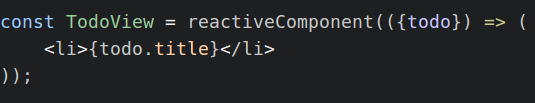

# mobx-react

[](https://travis-ci.org/mobxjs/mobx-react)
[](https://gitter.im/mobxjs/mobx?utm_source=badge&utm_medium=badge&utm_campaign=pr-badge&utm_content=badge)
[](https://discord.gg/0ZcbPKXt5bYAa2J1)


Package with react component wrapper for combining React with mobx.
Exports the `observer` decorator and some development utilities.
For documentation, see the [mobx](https://mobxjs.github.io/mobx) project.
This package supports both React and React-Native.

## Installation

`npm install mobx-react --save`

```javascript
import {observer} from 'mobx-react';
// - or -
import {observer} from 'mobx-react/native';
```

This package provides the bindings for MobX and React.
See the [official documentation](http://mobxjs.github.io/mobx/intro/overview.html) for how to get started.

## Boilerplate projects that use mobx-react

* Minimal MobX, React, ES6, JSX, Hot reloading: [MobX-React-Boilerplate](https://github.com/mobxjs/mobx-react-boilerplate)
* TodoMVC MobX, React, ES6, JSX, Hot reloading: [MobX-React-TodoMVC](https://github.com/mobxjs/mobx-react-todomvc)
* Minimal MobX, React, Typescript, TSX: [MobX-React-Typescript](https://github.com/mobxjs/mobx-react-typescript)
* Minimal MobX, React, ES6(babel), JSPM with hot reloading modules:
[jspm-react](https://github.com/capaj/jspm-react)
* React-Native Counter: [Mobservable-React-Native-Counter](https://github.com/bartonhammond/mobservable-react-native-counter)


## API documentation

### observer(componentClass)

Function (and decorator) that converts a React component definition, React component class or stand-alone render function into a reactive component.
See the [mobx](https://mobxjs.github.io/mobx/refguide/observer-component.html) documentation for more details.



### trackComponents()

Enables the tracking from components. Each rendered reactive component will be added to the `componentByNodeRegistery` and its renderings will be reported through the `renderReporter` event emitter.

### renderReporter

Event emitter that reports render timings and component destructions. Only available after invoking `trackComponents()`.
New listeners can be added through `renderReporter.on(function(data) { /* */ })`.

Data will have one of the following formats:

```javascript
{
    event: 'render',
    renderTime: /* time spend in the .render function of a component, in ms. */,
    totalTime: /* time between starting a .render and flushing the changes to the DOM, in ms. */,
    component: /* component instance */,
    node: /* DOM node */
}
```

```javascript
{
    event: 'destroy',
    component: /* component instance */,
    node: /* DOM Node */
}
```

### componentByNodeRegistery

WeakMap. It's `get` function returns the associated reactive component of the given node. The node needs to be precisely the root node of the component.
This map is only available after invoking `trackComponents`.

# Changelog

# 2.1.5

Improved typescript typings overloads of `observer`

# 2.1.4

Added empty 'dependencies' section to package.json, fixes #26

# 2.1.3

Added support for context to stateless components. (by Kosta-Github).

# 2.1.1

Fixed #12: fixed React warning when a component was unmounted after scheduling a re-render but before executing it.

# 2.1.0

Upped dependency of mobx to 1.1.1.

# 2.0.1

It is now possible to define `propTypes` and `getDefaultProps` on a stateless component:

```javascript
const myComponent = (props) => {
    // render
};

myComponent.propTypes = {
    name: React.PropTypes.string
};

myComponent.defaultProps = {
    name: "World"
};

export default observer(myComponent);
```

All credits to Jiri Spac for this contribution!

# 2.0.0

Use React 0.14 instead of React 0.13. For React 0.13, use version `mobx-react@1.0.2` or higher. 

# 1.0.2

Minor fixes and improvements

# 1.0.1

Fixed issue with typescript typings. An example project with MobX, React, Typescript, TSX can be found here: https://github.com/mobxjs/mobx-react-typescript

# 1.0.0

`reactiveComponent` has been renamed to `observer`

# 0.2.3

Added separte import for react-native: use `var reactiveComponent = require('mobx-react/native').reactiveComponent` for native support; webpack clients will refuse to build otherwise.

# 0.2.2

Added react-native as dependency, so that the package works with either `react` or `react-native`.

# 0.2.0

Upgraded to MobX 0.7.0

# 0.1.7

Fixed issue where Babel generated component classes where not properly picked up.

# 0.1.6

`observer` now accepts a pure render function as argument, besides constructor function. For example:

```javascript
var TodoItem = observer(function TodoItem(props) {
    var todo = props.todo;
    return <li>{todo.task}</li>;
});
```

# 0.1.5

observer is now defined in terms of side effects.

# 0.1.4

Added support for React 0.14(RC) by dropping peer dependency
